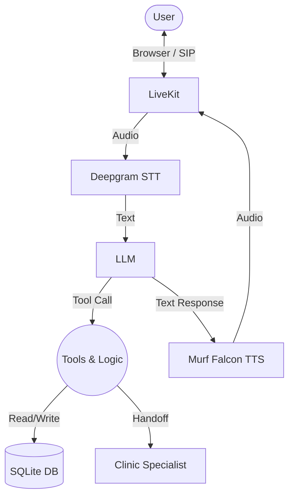

# JanMitra — Voice AI Healthcare Assistant 🏥🇮🇳

**Built for 10 Days of Voice Agents (#VoiceForBharat Edition) — Health Access Track**

### 1. JanMitra Introduction
JanMitra is a polite, empathetic, and safe AI healthcare information assistant designed to make healthcare knowledge accessible to everyone through voice.

### 2. Problem / Health Access Track
Accessing clear, reliable, and localized healthcare information can be difficult for many due to language barriers and text-heavy digital interfaces. JanMitra solves this by providing health-camp schedules, basic health awareness, and human escalation using natural spoken language.

### 3. Key Features
- **Voice Foundation**: Fast, natural real-time conversations.
- **Multilingual Support**: Supports English, Hindi (Devanagari), and Telugu (Telugu Lipi) with proper code-mixing understanding.
- **Persistent Memory**: Remembers user preferences safely, with explicit consent.
- **Real-World Health Information**: Provides actionable health camp schedules.
- **Safety Guardrails & Escalation**: Strictly refuses to diagnose or prescribe. Escalate symptoms to a human support queue securely.
- **Outbound Calling**: Proactive calls for health-camp reminders with a simple voice-based opt-out.
- **Specialist Handoff**: Connects users seamlessly to a Clinic and Appointment Specialist agent.
- **Call Analytics**: Tracks success rates, durations, and channels natively.

### 4. Technology Stack
- **LiveKit Agents SDK** — Real-time Voice Transport
- **Murf Falcon TTS** — Fastest Streaming Voice Engine (Pooja Voice)
- **OpenRouter (Groq Llama-3.3-70B fallback)** — LLM
- **Deepgram Nova-3** — Speech-to-Text
- **SQLite** — Local persistent database
- **Next.js & TailwindCSS** — Frontend & LiveKit UI

### 5. High-Level Architecture


### 6. Project Structure
```
murf-livekit-starter/
├── backend/
│   ├── src/
│   │   ├── agent.py
│   │   ├── database.py
│   │   └── outbound.py
│   ├── tests/
│   ├── .env.example
│   └── pyproject.toml
│
├── frontend/
│   ├── app/
│   ├── components/
│   ├── .env.example
│   └── package.json
│
├── README.md
└── .gitignore
```

### 7. Prerequisites
- **Python 3.10+** and `uv` package manager
- **Node.js 18+** and `pnpm` package manager
- A **LiveKit** project (free tier available)

### 8. Environment Variable Setup
Create a `.env.local` file in both `backend/` and `frontend/` by copying the respective `.env.example` files. You will need:
- `LIVEKIT_URL`, `LIVEKIT_API_KEY`, `LIVEKIT_API_SECRET`
- `OPENROUTER_API_KEY` (or `GROQ_API_KEY`)
- `MURF_API_KEY`
- `DEEPGRAM_API_KEY`

*Never commit `.env.local` or any real API keys to version control!*

### 9. How to run backend
```bash
cd backend
uv sync
uv run python src/agent.py dev
```

### 10. How to run frontend
```bash
cd frontend
pnpm install
pnpm dev
```

### 11. Basic Testing Instructions
1. Open `http://localhost:3000` in your browser.
2. Click **Start talking** and wait for the greeting.
3. Test Memory: State your name and language, say "yes" to save it, disconnect, and reconnect.
4. Test Guardrails: Ask for a medical diagnosis or report "chest pain" to trigger the Day 7 human escalation flow.
5. Test Handoff: Ask "Can you help me book a clinic appointment?" to trigger the Day 9 specialist agent.

### 12. Security Note
This repository contains no hardcoded API keys, tokens, SIP credentials, database files, or private URLs. The `.gitignore` files are explicitly configured to protect `.env.*` (except `.env.example`) and `*.db` files. Please verify before committing changes.

### 13. Day 10 Blog
[Read the Day 10 Blog Journey Here - Coming Soon]

### 14. Demo Status
JanMitra currently runs locally and has been tested through the browser-based LiveKit environment.
